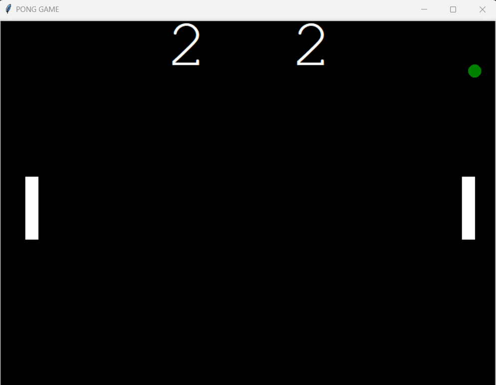

# Classic Pong Game

## Description

This repository contains a classic Pong game implemented in Python using the Pygame library. It is a two-player game where each player controls a paddle to hit the ball and prevent it from crossing their side of the screen. The game ends when one of the players reaches a certain score threshold.

## How to Play

1. Clone the repository to your local machine using the following command:

   -- git clone https://github.com/your-username/game-pong.git

2. Ensure you have Python and turtle installed on your system.

3. Navigate to the cloned repository's directory.

4. Run the game by executing the following command:

  -- python main.py

5. Player 1 (left side) can control their paddle using the `W` and `S` keys to move up and down, respectively.

6. Player 2 (right side) can control their paddle using the arrow keys `UP` and `DOWN`.

7. The game will continue until one player reaches the specified score, and the winner will be displayed on the screen.

## Features

- Classic Pong gameplay with player-controlled paddles.
- Score tracking for both players.
- Simple and intuitive controls.

## Requirements

- Python 3.x
- turtle library

## Acknowledgments

- The turtle community for providing the excellent library for game development.
- Inspiration from the original Pong game by Atari, released in 1972.

## Contact

If you have any questions, suggestions, or just want to say hi, you can reach me at m.sahat.hk@gmail.com or through the GitHub repository's issue tracker.

Happy Gaming!
